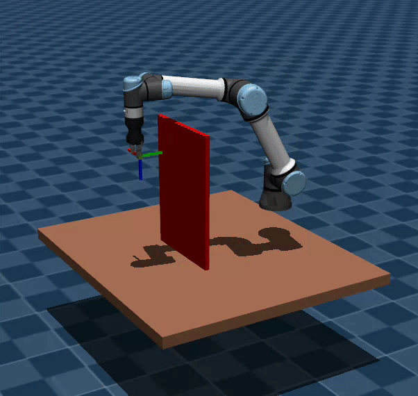

# Model-based planning using GPU-accelerated Simulator as a World Model

This is an implementation of model-based (MB) planner that utilizes MuJoCo MJX physics simulator as a world model. This repository contains the MB-planner that is capable of generating a smooth, constrained and collision free path. In addition, the framework
supports flexible task objectives by adjusting the cost function, enabling goal-driven behavior under varying conditions.

<table>
  <tr>
    <td align="center" width="33%" valign="top">
  <div style="height: 350px;">
    <br>
    <b>Offline Planning</b><br>
    The entire trajectory is planned offline and executed afterwards.
  </div>
</td>
<td align="center" width="33%" valign="top">
  <div style="height: 350px;">
    <br>
    <b>Online Planning: Collision Avoidance</b><br>
    The robot reaches target position and orientation while avoiding obstacles (red).
  </div>
</td>
<td align="center" width="33%" valign="top">
  <div style="height: 28350px0px;">
    <br>
    <b>Online Planning: Contact Task</b><br>
    The robot pushes the object (green sphere) to the target location (white square).
  </div>
</td>
  </tr>
  <tr>
    <td colspan="3">
        <table width="100%">
            <tr>
                <td align="center">
                <br>
                <b>Online Planning: Real-Life</b><br>
                The MB-planner is used to control real UR5e in dynamic environment. 
                </td>
                <td align="center">
                <br>
                <b>Online Planning: Real-Life</b><br>
                The MB-planner is used to control real UR5e in dynamic environment.
                </td>
            </tr>
        </table>
    </td>
  </tr>
</table>

## Repository Structure

* ***___data/___:***  Folder to which the cost data and trajectory are saved.
* ***___ur5e_hande_mjx/___:***  The MuJoCo model description.
* ***___trajectory_sampler.py___ :***  The code for trajectory sampling from multivariate normal distribution and application of constraints.
* ***___cem_optimization.py___ :***  The code for trajectory optimization with Cross-Entropy Method.
* ***___mpc_planner.py___ :***  The code for online planning using Model Predictive Control strategy.
* ***___visualizer.py___ :***  The code for visualizing current MuJoCo environment and/or recorded trajectory from ___/data___ folder.

The code for the demos displayed above is located on separate branches of this repository:
| Demo | Branch |
|----------|----------|
| Offline Planning  | ___offline_demo___  |
| Online Planning: Collision Avoidance  | ___online_demo_1___  |
| Online Planning: Contact Task  | ___online_demo_2___  |
| Online Planning: Real-Life  | ___real_life_demo___  |

## Installation
___NOTE: NVIDIA graphics card is required.___

```
$ git clone https://github.com/patsyuk03/mjx_planner.git
$ cd mjx_planner
$ pip install -r requirements.txt
```

## Run the Example

```
$ python3 mpc_planner.py
```


