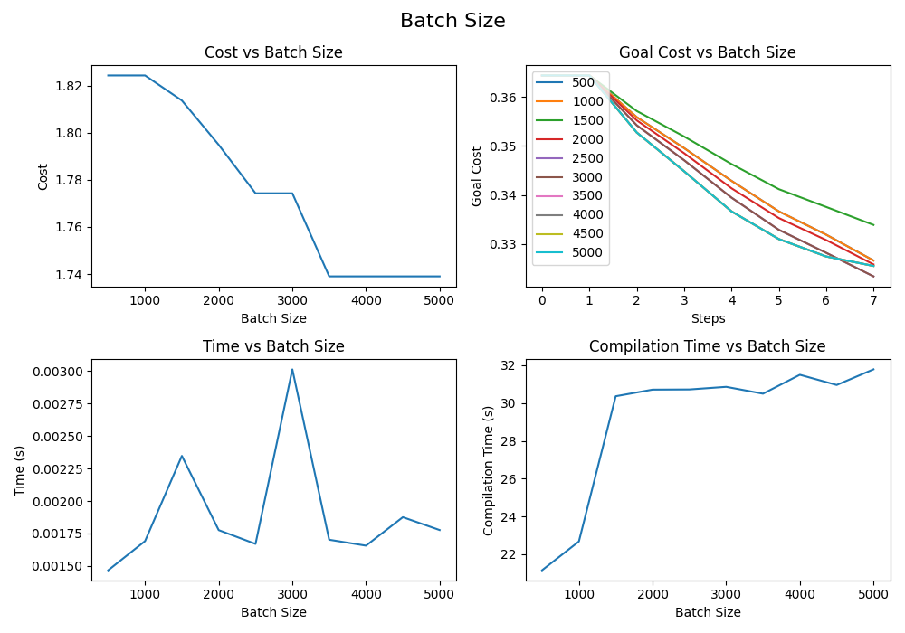

# Offline Demo
This branch contains an example of using CEM optimizer for the offline planning. In this demo no MPC was used. The whole trajectory is generated, optimized with CEM and executed after the optimization is done. 

## Description
The manipulator robot needs to reach the goal (green) while avoiding obstacle (red) (Figure 1). For this demo the cost function is composed of the distance to the goal, rotation alignment and collision avoidance parts (Figure 2). The CEM parameters for the following plots where:
```
 Simulation timestep: 0.05 s
 CEM iterations: 30 
 Number of batches: 2000 
 Number of steps per trajectory: 50 
 Time per trajectory: 2.5 s
```
The total time of CEM optimization with those parameters was 1 minute.

<div align="center">
  
  <p><em>Figure 1:</em> Scene</p>
</div>

<div align="center">
  
  <p><em>Figure 2:</em> Cost plots</p>
</div>

<div align="center">
  
  <p><em>Figure 3:</em> Optimized Trajectory</p>
</div>

## How to run the code
The following command will run the optimization and save the final trajectory to the _/data/thetadot.csv_ :
```bash
$ python3 cem_optimization.py 
```

After that the saved trajectory can be executed with:
```bash
$ python3 visualizer.py 
```